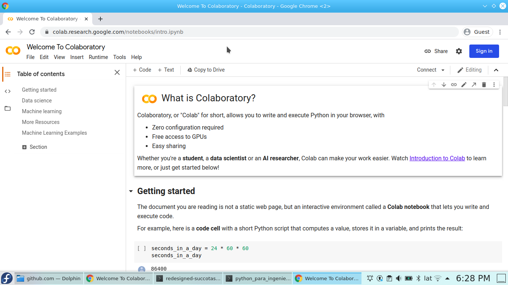
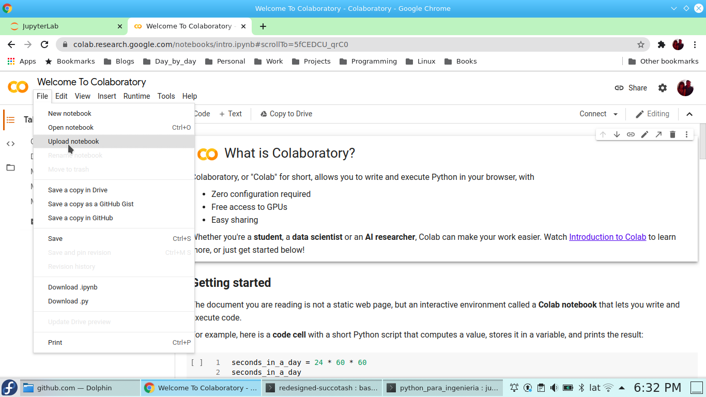
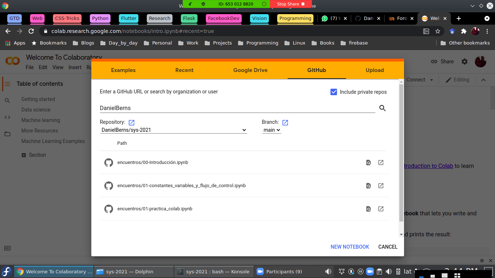
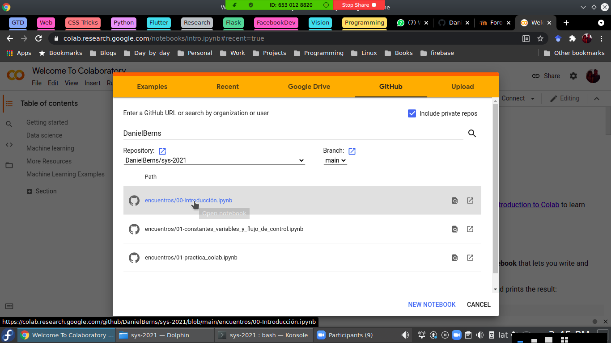

# SyS-2021

Este es un curso de programación, empleando Python, para universitarios que
necesitan automatizar el procesamiento de información en su trabajo cotidiano.

Vamos a empezar trabajando en [Google Colab](https://colab.research.google.com/)

En [Google Colab](https://colab.research.google.com/) podemos hacer nuestros propios archivos

o podemos utilizar archivos ya creados 

Vamos a usar archivos del curso que están en [Github](https://github.com/DanielBerns/sys-2021)

Comenzamos por el archivo 00-Introducción.ipynb

También vamos a trabajar en un [PythonAnywhere](https://www.pythonanywhere.com/)
